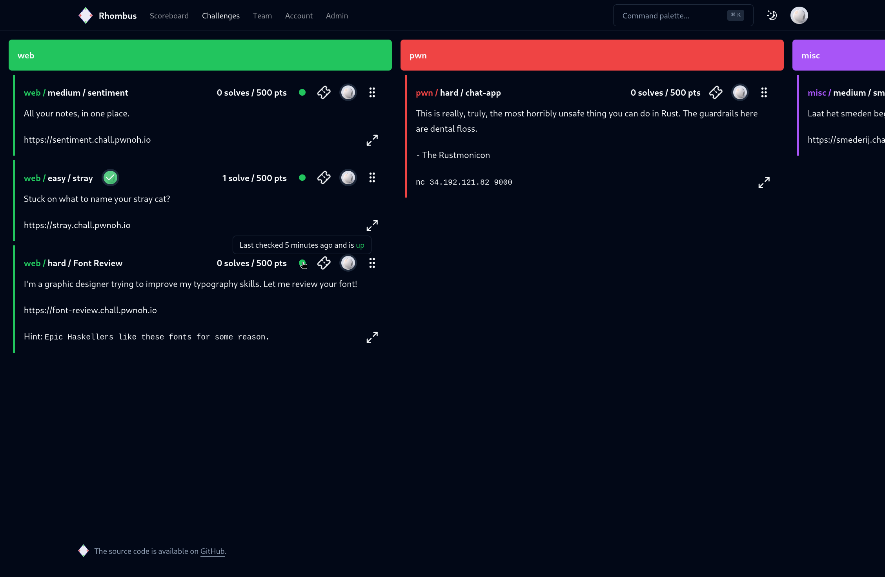
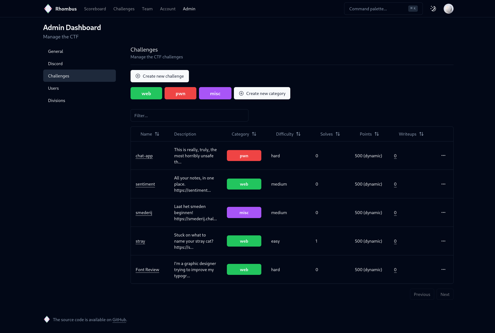
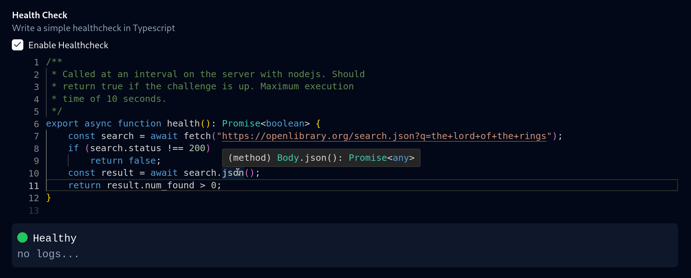
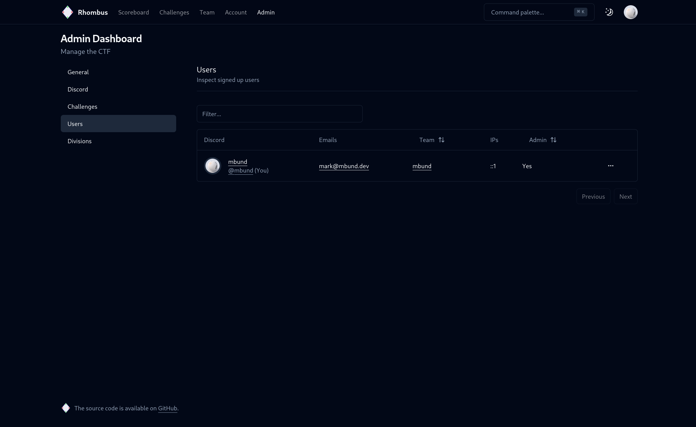

# Rhombus

Next generation CTF framework with batteries included and a focus on ease of use.

Jump to [features](#features)

## Features

- [x] Modern, responsive UI written in Svelte
- [x] Customizable categories and colors
- [x] Native Discord server integration for teams and challenge issue tickets
- [x] Advanced challenge healthchecks written in Typescript
- [x] User logging and Discord <-> IP address mapping for auditing purposes
- [x] Automatic scoreboard division eligibility based on player email domains (e.g. a university division where every player must have a `.edu` email address)
- [x] Integrated writeup submission system after players solve a challenge
- [ ] REST API
- [ ] Native challenge deployment system
